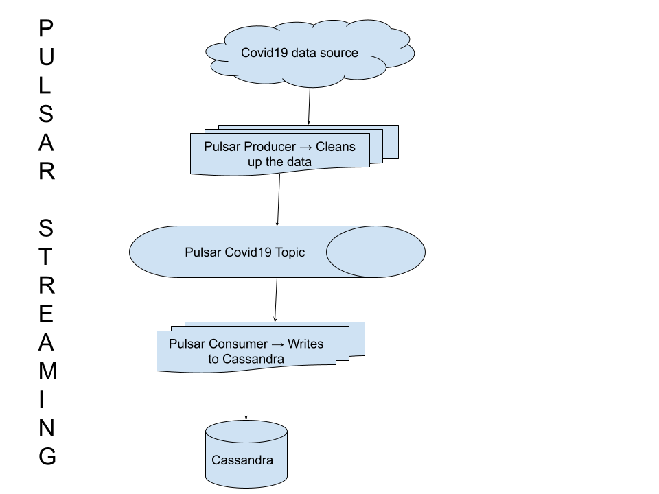
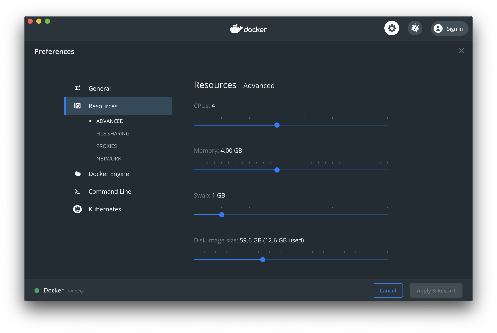

# Pulsar to Cassandra with Covid19



## Step 1: Make sure you have docker installed and running on your machine!

* [Install Docker](https://www.docker.com/products/docker-desktop)
* Make sure your docker has enough Juice



1. Right click on Docker Desktop icon
1. Select Preferences
1. Select Resources
1. Set CPUs = 4
1. Set Memory to at least 4GB
1. Press the Apply & Restart button to make the changes.

## Step 2: Create the network

```
docker network create -d bridge pulsar-demo
```


## Step 3: [Download DSE pulsar connector and put in this current directory](https://downloads.datastax.com/#apc)

## Step 4: extract contents of the package

```
tar zxf cassandra-enhanced-pulsar-sink.tar.gz
```


## Step 5: Create Connectors folder

```
mkdir connectors
```


## Step 6: Move the contents of the package

```
mv cassandra-enhanced-pulsar-sink-1.4.0/cassandra-enhanced-pulsar-sink-1.4.0.nar connectors/cassandra-enhanced-pulsar-sink-1.4.0.nar
```

## Step 7: Turn on pulsar (may take a long time) (2GB!)

```
docker run -v `pwd`/connectors:/pulsar/connectors --rm --network pulsar-demo -d -p 6650:6650 -p 8080:8080 --name pulsar apachepulsar/pulsar-standalone
```

### Validate that it is running!

Wait until pulsar gives you the OK status

```
docker logs pulsar | grep "messaging service is ready" 
```

You should get something like the below in the logs 

*23:26:24.517 [main] INFO  org.apache.pulsar.broker.PulsarService - messaging service is ready*

### Validate the Cassandra Enhanced Connector is running

```
curl -s http://localhost:8080/admin/v2/functions/connectors
```

You should get output like the below

*[{"name":"cassandra-enhanced","description":"A DataStax Pulsar Sink to load records from Pulsar topics to Apache Cassandra(R) or DataStax Enterprise(DSE)\n","sinkClass":"com.datastax.oss.sink.pulsar.RecordCassandraSinkTask"}]*


## Step 8: Create the cassandra Keyspace and Table

```
CREATE KEYSPACE IF NOT EXISTS zekedean
WITH replication = {
  'class' : 'SimpleStrategy',
  'replication_factor' : 1
}
```

```
CREATE TABLE IF NOT EXISTS covid19 (
  	country text ,
  	confirmed int,
  	deaths int,
  	recovered int,
  	date text,
  	PRIMARY KEY((country),date)
);
```

Primary Key is country, clustering collum is date

## Step 9: Turn on the Pulsar Consumer (with Python)

### First export your Astra username and password as an environment variable  

```
export ASTRA_USER=blahblah
export ASTRA_PASS=blahblah
```
### Now process the data and send to astra

```
docker run  -e ASTRA_USER=$ASTRA_USER -e ASTRA_PASS=$ASTRA_PASS -ti --network pulsar-demo -v `pwd`:/usr/src/app   apachepulsar/pulsar  /usr/src/app/pulsar_client_to_astra.sh
```

## (optional): Send to Cassandra (With Pulsar Functions) **(not currently working)**

```
docker run  -ti --network pulsar-demo -v `pwd`:/usr/src/app   apachepulsar/pulsar /usr/src/app/pulsar_to_astra_localrun.sh
```

You should get output like the below

*"Created successfully"*

## Step 10: Load the Covid19 data into Pulsar

```
docker run  -ti --network pulsar-demo -v `pwd`/python_client:/usr/src/app   apachepulsar/pulsar  python3.7 /usr/src/app/covid19_datacleaner.py
```

#### *Troubleshooting*

If you see the error message below:
```
docker: Error response from daemon: Conflict. The container name "/astra-client" is already in use by container "d61af1d11fd8d39ad1138453a7b761dae657a9e0bc19ce3fc94227404eb92c8d". You have to remove (or rename) that container to be able to reuse that name.
See 'docker run --help'.
```

You might have to simply remove the named containers for the consumers, you can do so with the following command

```
docker stop astra-client
docker rm astra-client
```

## Step 11: Display in Astra Studio

Do some querying!


Get all confirmed covid cases for that day to date
```
Select sum(confirmed) from  acovid19 where date='2021-02-20'   ALLOW FILTERING;
```

```
Select * from  covid19 where date='2020-12-01' and country='Zimbabwe'  ALLOW FILTERING;
```

### Do some visualizations!


