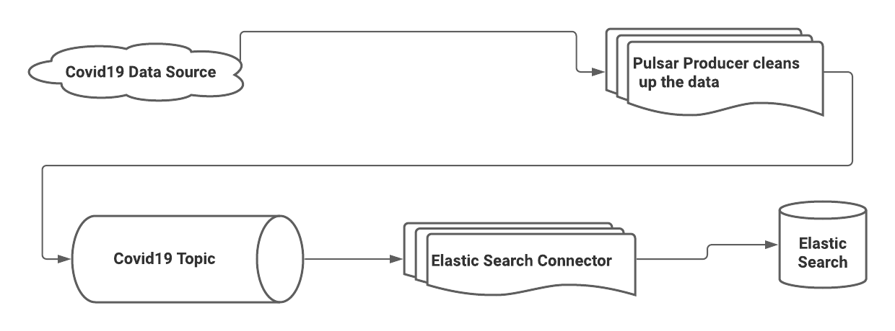

# Pulsar to Cassandra with Covid19



**[If you want to just try pulsar with elastic seach check out this link](https://pulsar.apache.org/docs/en/io-elasticsearch-sink/)**

## Step 1: Make sure you have docker installed and running on your machine!

* [Install Docker](https://www.docker.com/products/docker-desktop)
* Make sure your docker has enough Juice


1. Right click on Docker Desktop icon
1. Select Preferences
1. Select Resources
1. Set CPUs = 6
1. Set Memory to at least 6GB
1. Press the Apply & Restart button to make the changes.


## Step 2: Turn on pulsar and elastic search (may take a long time) (2GB!)

```
docker-compose up
```

## Step 3: Open another terminal tab

### Validate that it is running!

Wait until pulsar gives you the OK status

```
docker logs pulsar | grep "messaging service is ready" 
```

You should get something like the below in the logs 

*23:26:24.517 [main] INFO  org.apache.pulsar.broker.PulsarService - messaging service is ready*


## Step 4: Load the Covid19 data into Pulsar

```
docker run  -ti --network covid19-with-pulsar_default -v `pwd`/python_client:/usr/src/app   apachepulsar/pulsar  python3.7 /usr/src/app/covid19_datacleaner.py
```

## Step 5: Open another terminal tab

## Step 6: Turn on the elastic search connector

```
docker run  -ti --network covid19-with-pulsar_default -v `pwd`:/usr/src/app   apachepulsar/pulsar /usr/src/app/pulsar_to_elasticsearch_localrun.sh
```

## Step 7: Open another tab

## Step 8: Get some records!

```
curl -s http://localhost:9200/my_index/_refresh
```


```
curl -s http://localhost:9200/my_index/_search
```

### [Do some visualizations!](http://localhost:5601/app/kibana#/management/kibana/index_pattern?_g=())


